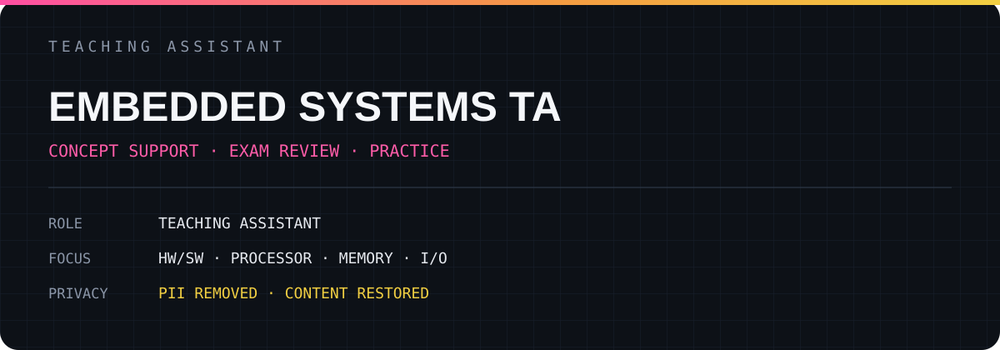

# EMBEDDED SYSTEMS TA

TA 활동에서 실제로 사용한 설명·실습·질의응답 기록을 복원한 공개 아카이브입니다.

## Archive

- [전체 TA 자료 보기](./FULL_NOTES.md)
- 총 **5개 페이지**의 기록 수록
- 수업 내용, 코드, 문제 풀이와 설명은 유지
- 학생 이름·학번·이메일·전화번호·점수·채점표만 제거

## Scope

`HW/SW` · `PROCESSOR` · `MEMORY` · `I/O`

